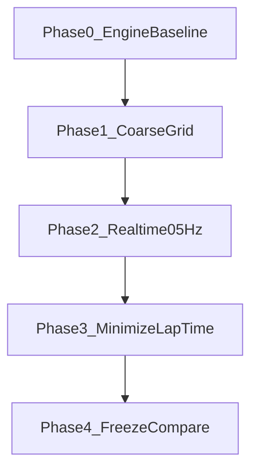

# MPC circuit lap-time tuning (`mpc_tuning`)

Active design backlog for per-model MPC hyperparameter search on the
rounded-rectangle circuit. Implementation home:
[`examples/projects/mpc_tuning/`](../../examples/projects/mpc_tuning/).

Contracts stay in [DESIGN.md](../../DESIGN.md); this doc is the search plan only.

## Goal

For each plant below, find planner + MPC hyperparameters that **complete one
closed lap as fast as possible**, starting **from rest**, on the shared
rounded-rectangle track (path + corridor, **no obstacles**).

| Key | Plant | Baseline today |
| --- | --- | --- |
| `kinematic` | `BicycleKin` | Drives OK |
| `kinematic_rate` | `BicycleAcc` | Drives OK |
| `dynamic_rate` | `BicycleDynRate` | Drives OK |
| `dynamic_engine` | `BicycleDynEngine` | **Deferred** — closed-loop path tracking not yet viable; skip Phases 1–4 for now |

Tune **independently** (four separate configs). Do not share one hyperparameter
vector across models.

### Metrics

**Primary:** lap time \(T_\mathrm{lap}\) (arc-length progress ≥ one lap, or
start-gate return with forward heading).

**Validity gates (trial counts only if true):**

1. Completes one lap within `TF_SIM_MAX` (e.g. 60–90 s).
2. Corridor / path error within thresholds (mean and max).
3. Soft real-time: median replan `solve_s` ≲ **0.2 s** with `MPC_DT = 0.2`
   (5 Hz). Phases 0–1 may relax (3); Phase 2+ enforce.

**Secondary (log always):** mean path error, NLP success rate, p95 `solve_s`,
peak steer / power, final speed.

## Project layout

```text
examples/projects/mpc_tuning/
  README.md                 # how to run harness + search (short)
  track.py                  # rounded-rectangle + ReferenceTrack
  models.py                 # builders for the four plants + default costs
  harness.py                # run_lap(model_key, config) → LapResult
  search.py                 # CLI: --model= --phase= ...
  configs/
    seed_<model>.json       # starting configs from compare demo
    best_<model>.json       # frozen winners (Phase 4)
  results/                  # trial JSONL / summaries (gitignored bulk)
```

Interactive compare:
[`examples/projects/mpc_tuning/compare_demo.py`](../../examples/projects/mpc_tuning/compare_demo.py)
(loads `configs/best_*.json` when present).

## Mission (shared harness)

- Track: large rounded rectangle (same family as the compare demo:
  `CIRCUIT_LX/LY/R`, corridor half-width).
- Start **from rest**: Kin \(u\)-consistent zeros; Acc/Dyn \(v_x=0\),
  \(\omega_r=0\); Engine lagged \(P\) seeded per config.
- Pose on track start with path tangent heading.
- End: first time \(s \ge L_\mathrm{lap}\) (or gate).
- Inner plant step fine (`plant_dt_inner` ~ 0.005–0.01); optional small plant
  param mismatch as a boolean knob.
- Headless eval (`MPLBACKEND=Agg`); persist every trial as one JSON object.

```python
@dataclass
class LapResult:
    completed: bool
    lap_time: float | None
    mean_path_error: float
    max_path_error: float
    median_solve_s: float
    p95_solve_s: float
    nlp_success_rate: float
```

## Hyperparameters (per model)

### Structure / solver

| Param | Role | Search notes |
| --- | --- | --- |
| `MPC_DT` | replan period | Fix **0.2** after Phase 0 (5 Hz target) |
| `MPC_HORIZON` | look-ahead [s] | e.g. {1.0, 1.5, 2.0, 2.5, 3.0} |
| `MPC_STEPS` | collocation knots | e.g. {8, 10, 12, 15, 20}; keep \(\Delta t=tf/n\) sane |
| `optimizer_method` | NLP | `scipy_slsqp` default; `ipopt` for Engine / hard cases |
| `maxiter` | NLP budget | e.g. {50, 100, 150, 200} |
| `ftol` | convergence | e.g. {0.1, 0.05, 0.01, 1e-3} |

Keep `transcription="direct_collocation"`, `compile_backend="jax"`,
`warm_start=True` unless a trial proves otherwise.

### Cost / cruise (model-specific)

Shared: `PATH_COST_WEIGHT`, `CORRIDOR_COST_WEIGHT`, `U_TARGET`.

Per-model \(Q,R,S\) / `ubar` (Kin / Acc / DynRate / Engine). Engine **must**
keep watt-consistent `R_P`, accel-biased `ubar`, and \(P\) seed — poor scaling
is why the current Engine baseline fails.

Bounds (δ, \(a_x\), \(\dotδ\), \(P_\mathrm{peak}\), \(w_\mathrm{rear}\)) are
secondary after costs work.

## Phases



### Phase 0 — Engine path-following baseline (blocking)

Until Engine completes a slow on-track lap, do **not** optimize lap time for it.

- `apply_car_profile(..., "racecar")` (or agreed profile).
- Fix cost scaling: path/corridor vs speed; `ubar` / `R_P` / \(P(0)\).
- Try `ipopt` vs `slsqp` if success rate is poor.
- Conservative `U_TARGET` (e.g. 8–12 m/s) for validity first.

**Exit:** one full lap, path error within corridor, animation looks sane.

### Phase 1 — Coarse grid (all four)

~20–40 trials/model: horizon × steps × `{maxiter,ftol}` × `U_TARGET` ×
path/corridor weights. Prefer SLSQP; Ipopt as Engine rescue. Record solve
times; do not discard slow trials yet (Pareto map).

### Phase 2 — Enforce ~5 Hz

Keep valid trials with median `solve_s` ≲ 0.25 s, then tighten toward **0.2 s**
(fewer steps, shorter horizon, coarser `ftol`, lower `maxiter`). Drop cold
first-replan from timing stats if needed.

### Phase 3 — Lap-time local search

From each model’s best valid + near-real-time config: coordinate descent /
small random perturbations on costs, `U_TARGET`, horizon. Minimize
\(T_\mathrm{lap}\) under corridor + solve-time gates (~30–50 evals/model).

### Phase 4 — Freeze and report

- Write `configs/best_<model>.json`.
- Optional: compare demo loads best configs.
- Table: lap time, path error, median/p95 `solve_s`, NLP success, solver.

## Search style

v1: scripted grid + light random / coordinate descent. Persist every trial.
No Bayesian optimizer required.

Prefer changes under `examples/projects/mpc_tuning/` over `minilink/` API
changes unless Engine is blocked on a library bug.

## Risks

- Engine watt-scale NLP conditioning dominates; treat Engine cost knobs as
  first-class and model-specific.
- Long horizon + high `U_TARGET` fights the 0.2 s budget — Phase 2 owns that
  tradeoff.
- Ipopt is rescue, not default for Kin / Acc / Rate unless it wins at equal
  solve budget.

## Out of scope

- Obstacles / keepouts.
- LOS cascade projects (`bicycle_mpc_v4` / `v5`).
- Changing plant EoMs (profile + costs only unless blocked).

## Implementation order

1. Scaffold `examples/projects/mpc_tuning/` + harness + seed configs from the
   current compare demo.
2. Phase 0 Engine baseline until a valid lap exists.
3. Phase 1–3 search loops per model.
4. Phase 4 freeze + short README + optional compare-demo wiring.

## Approval

Await go-ahead before creating the folder tree and Phase 0 work.
