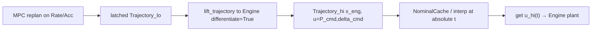
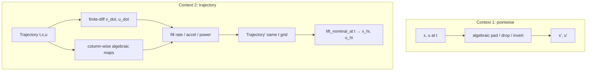

# Phase 4 — Cross-fidelity maps (design)

Status: draft plan (July 2026). Active backlog — not implemented yet.

Locked defaults: **bicycle ladder only** (Kin → Acc → Dyn → Rate → TauRate →
Servo → Engine); Holonomic deferred. Maps live in
[`minilink/dynamics/catalog/vehicles/jax_vehicle_maps.py`](../../minilink/dynamics/catalog/vehicles/jax_vehicle_maps.py)
(to create). Pointwise functions are the core; trajectory wrappers batch them
and supply derivatives via finite differences (same spirit as MPC
`_finite_diff_knots` in
[`minilink/control/mpc/utilities.py`](../../minilink/control/mpc/utilities.py)).
No change to `Trajectory` beyond using `resample` / `with_signal`.

## Checklist

- [ ] Lock `jax_vehicle_maps` API: adjacent lift/project + `lift_trajectory` (FD) + `lift_nominal_at` + `estimate_propulsion_power`
- [ ] Implement Kin↔Acc↔Dyn↔Rate↔TauRate↔Servo↔Engine pointwise maps
- [ ] Implement `lift_trajectory` + `lift_nominal_at(t)` using FD rates from low-fid traj
- [ ] Demo/smoke: MPC on Rate (or Acc), lift plan to Engine, broadcast `P_cmd`/`delta_cmd` at `t`
- [ ] Unit round-trips + DESIGN note; notebook cell for lift-at-`t`

## Naming (locked)

| Direction | Verb | Meaning |
| --- | --- | --- |
| low → high fidelity | **`lift`** | pad / reconstruct missing states and inputs (and rates from traj FD when needed) |
| high → low fidelity | **`project`** | drop / compress onto the coarser state–input |

Examples: `lift_rate_to_engine`, `project_engine_to_rate`, `lift_trajectory`, `lift_nominal_at`.

Why this pair (not expand/reduce, promote/demote, embed/restrict):

- Standard in reduced-order / multi-fidelity modeling (lift reduced→full, project full→reduced).
- Reads well for a mechanical audience on a **fidelity ladder**.
- One vocabulary only (pre-1.0 no-alias): do **not** ship parallel `expand_*` names.

`estimate_propulsion_power` stays a helper name (not a lift/project hop).

## Flagship use case — low-fid MPC → high-fid nominal at `t`

**Story:** replan with a cheap plant (e.g. `BicycleDynRate` or `BicycleAcc`); at
broadcast rate, apply a **high-fid** command to a richer plant (e.g.
`BicycleDynEngine` needs `P_cmd`). Derivatives along the latched plan make power
/ rates estimable even though the NLP never saw Engine states.



Matches today’s dual-rate pattern in
[`demo_mpc_path.py`](../../examples/scripts/mpc/demo_mpc_path.py) /
[`MPCBroadcastController`](../../minilink/control/mpc/controller.py):

```text
# slow timer — low-fid NLP (unchanged)
cmd = mpc.compute_command(x_lo, t=t)
traj_hi = lift_trajectory(cmd.plan.trajectory, lift_rate_to_engine, params=..., differentiate=True)
# build interpolator on traj_hi (or lift_nominal_at each fast tick)

# fast timer — high-fid nominal
x_hi, u_hi = lift_nominal_at(cmd.plan.trajectory, t, lift_rate_to_engine, ...)
# u_hi = [P_cmd, delta_cmd]  →  Engine plant / allocator
```

**Why trajectory (not pointwise alone):** Rate→Engine needs `τ≈Jω̇+τ_ground` then
`P≈τ·ω` (or chain Rate→TauRate→Servo→Engine). `ω̇` / `δ̇` are not in Rate
*state*; they are Rate *inputs* along the plan, or else FD of `ω_r(t)`, `δ(t)`
when lifting from Acc/Dyn. Sampling only `(x(t),u(t))` without neighbors cannot
invent those rates.

**v1 integration choice:** maps stay **outside** MPC (caller lifts after latch).
Do not change `generate_nominal_interpolator` internals — pass an already-lifted
`Trajectory` into a thin helper that builds the same FD cache shape, or sample
with `lift_nominal_at`. Optional later: `generate_nominal_interpolator(lift_fn=...)`.

## Why two contexts



| Context | Enough when | Needs traj when |
| --- | --- | --- |
| **Pointwise** `(x,u)→(x',u')` | Pad/drop; hold commands; invert wheel EoM if rate already in `u` | Target needs rates / `P` from history |
| **Trajectory + sample at `t`** | Dual-rate broadcast, warm-start whole horizon, Engine `P_cmd` from Rate plan | Flagship MPC case above |

Teaching demos already pad by hand in
[`demo_car_trajopt_compare.py`](../../examples/scripts/trajectory_optimization/demo_car_trajopt_compare.py).
Phase 4 makes that shared and honest about when zeros are wrong.

## Ladder dimensions (reference)

| Rung | `x` gist | `u` |
| --- | --- | --- |
| Kin | `[x,y,θ]` | `[v,δ]` |
| Acc | `[x,y,θ,v,δ]` | `[a_x, δ̇]` |
| Dyn | pose + `[vx,vy,r]` | `[ω_r, δ]` |
| Rate | Dyn + `[ω_r,δ]` | `[ω̇_r, δ̇]` |
| TauRate | same as Rate | `[τ, δ̇]` |
| Servo | Rate + `τ` | `[τ_cmd, δ_cmd]` |
| Engine | Rate + `P` | `[P_cmd, δ_cmd]` |

Reuse existing:
[`BicycleDynRate.inverse_propulsion_dynamics`](../../minilink/dynamics/catalog/vehicles/jax_vehicles.py)
for Rate→τ;
[`CarProfile.power_torque_at_speed`](../../minilink/dynamics/catalog/vehicles/car_profile.py)
only for **bounds/ratings**, not as the map body (Engine EoM is
`τ=clip(P/ω,±τ_sat)`).

## Map taxonomy (what each hop does)

**Algebraic (pointwise OK)**

- **Project** (drop): Acc→Kin drop `v,δ` into `u`; Rate→Dyn drop actuator states into `u`; Servo→TauRate use `τ` as `τ_rear` and FD/project `δ̇` if available else 0.
- **Lift** (pad with kinematics): Kin→Acc pad `v,δ` from `u`, set `a_x=δ̇=0` unless traj FD; Acc→Dyn: `vx=v`, `vy=0`, `r=(v/L)tanδ`, and for Dyn `u`: `ω_r=v/r_r`, `δ` from Acc state; Dyn→Rate: copy body, move `ω_r,δ` into state, set rate `u=0` unless traj FD.
- **Rate ↔ TauRate**: `τ = inverse_propulsion_dynamics(x, [ω̇, δ̇])`; reverse `ω̇ = (τ - τ_ground)/Jw` (same ground torque helper).
- **TauRate ↔ Servo**: lift pads `τ` state from `u[0]`, `u'=[τ, δ]` with `δ̇→0` unless traj; project uses `τ` as command and needs `δ̇` from traj or 0.
- **Servo ↔ Engine**: `P ≈ τ·ω_r` (unsaturated estimate); `τ ≈ clip(P/ω_safe, ±τ_sat)`; commands map level↔level (`τ_cmd↔P_cmd`) with same formula. Document: under `τ_sat`, `P` is command power, not always `τ·ω`.

**Differential (prefer trajectory)**

- Any lift **into** Acc / Rate / TauRate steer-rate / Servo rate-limited steer when the source has only levels:
  `a_x ≈ Δv/Δt`, `δ̇ ≈ Δδ/Δt`, `ω̇ ≈ Δω/Δt` on the knot grid (forward/central FD; endpoints one-sided).
- Optional enrichment: attach `x_dot` / reconstructed `u_rate` via `Trajectory.with_signal` for debugging, without changing `(x,u)` contract for warm-start.

**Multi-hop:** compose adjacent maps (`lift_kin_to_dyn = lift_acc_to_dyn ∘ lift_kin_to_acc`). No all-pairs combinatorial API in v1. Composed `lift_rate_to_engine` is the flagship multi-hop.

## Proposed API shape

```text
# Pointwise — NumPy arrays
lift_kin_to_acc(x, u, *, params) -> (x_acc, u_acc)
project_acc_to_kin(x, u, *, params) -> (x_kin, u_kin)
... adjacent pairs through Engine ...

estimate_propulsion_power(x, u, *, rung, params) -> float
# Rate/TauRate/Servo: τ*ω; Engine: state P

# Trajectory — same t grid; FD when rates missing
lift_trajectory(traj, lift_fn, *, params, differentiate=True) -> Trajectory

# Sample high-fid nominal at t (flagship MPC broadcast)
lift_nominal_at(traj_lo, t, lift_fn, *, params, differentiate=True) -> (x_hi, u_hi)
# Prefer: lift whole plan once per replan, then interp; lift_nominal_at may wrap that
```

Rate→Engine (composition used by the flagship):

```text
lift_rate_to_engine = lift_servo_to_engine ∘ lift_taurate_to_servo ∘ lift_rate_to_taurate
# differentiate=True: use Rate u=[ω̇,δ̇] or FD of ω_r,δ
# P_cmd ≈ τ * ω_r; δ_cmd from steer
```

Implementation notes (match [AGENTS.md](../../AGENTS.md)):

- Pure functions; `params` dict (minimal EoM keys). Reuse `Jw*w_dot + tau_ground` math from `inverse_propulsion_dynamics`.
- Unpack locals; math-readable names (`v`, `delta`, `w_rear`, `L`, `r_r`).
- `differentiate=False` ⇒ zeros for missing rates (current demo behavior).
- **Lift once per replan**, interp at broadcast `t` (cheap fast path).

## How this plugs into existing workflows

1. **Flagship — dual-rate Engine broadcast:** MPC plant = Rate (or Acc); plant/allocator = Engine; after `compute_command`, lift latched traj → Engine `(x,u)`; fast timer samples `u_hi(t)=[P_cmd,δ_cmd]` like [`demo_mpc_path.py`](../../examples/scripts/mpc/demo_mpc_path.py) samples same-fid `u_nom`.
2. **TrajOpt warm-start:** lift cheap plan → rich `Trajectory` → `pack_initial_guess` / `resample`.
3. **MPC warm-start (same dims):** still `mpc_warm_start_guess`; cross-fid lift is for **broadcast / allocation**, planning stays low-fid unless the user remaps warm-start separately.
4. **Notebook:** short cell — Rate/Acc traj → Engine `P_cmd(t)` strip.

## Verification (when implementing)

- Round-trip project∘lift ≈ identity on shared coords within FD noise.
- Rate↔TauRate: `inverse_propulsion_dynamics` consistency with existing unit tests.
- Trajectory: coast → near-zero rates; ramp steer → nonzero `δ̇`.
- **Use-case smoke:** Rate plan with nonzero `w_rear_dot` → Engine `P_cmd` ~ `τ·ω`; `lift_nominal_at` mid-horizon matches `lift_trajectory` column.
- Optional thin dual-rate smoke with Engine plant (comment block mirroring `demo_mpc_path`).

## Docs

- Module docstring: algebraic vs FD hops + **MPC lift-for-broadcast** recipe.
- DESIGN: one paragraph next to jax_vehicles ladder.
- Notebook: lift-at-`t` / `P_cmd` strip, not a full bake-off.

## Out of scope (v1)

- Holonomic ↔ bicycle maps.
- Analytic derivatives through `f` (FD on traj knots).
- Changing `generate_nominal_interpolator` signature (callers lift first).
- LOS `vehicle.py` / Simon plant changes.
- View-ports from [vehicle-abstraction.md](vehicle-abstraction.md).

## Suggested implementation order

1. Module skeleton + Kin↔Acc + Acc↔Dyn + `lift_trajectory` / `lift_nominal_at`.
2. Dyn↔Rate … Servo↔Engine + `estimate_propulsion_power` + composed `lift_rate_to_engine`.
3. Unit tests + MPC-style smoke (Rate plan → Engine `u_hi(t)`).
4. DESIGN note; mark this plan done and remove or archive when landed.
